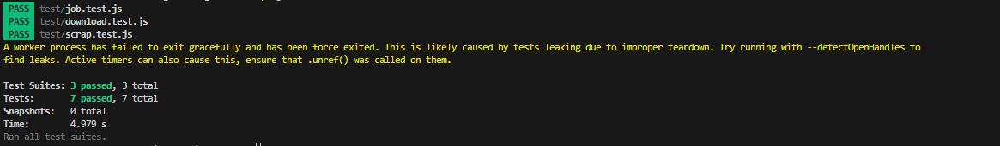

# Express.js Unit Test

This is a unit testing file using Jest and Supertest

## Getting Started

Follow these instructions to run this test on your local machine.

- [Jest](https://jestjs.io/)
- [Supertest](https://github.com/visionmedia/supertest)

### Run

```bash
npx jest
```

### Test Case

CRUD Jobs

```bash
GET JOB
# Test to get jobs data
- should get jobs data
- should filter when get jobs data

POST JOB
# Test to create jobs data
- should create jobs data

PUT JOB
# Test to update jobs data
- should update jobs data

DELETE JOB
# Test to delete jobs data
- should delete jobs data

```

Download Excel

```bash
GET DOWNLOAD
# Test to download data into excel
- should return an Excel file
```

Generate/Scrapping Jobs Data

```bash
GET SCRAP
# Test to scrap/generate data from jobstreet
- should scrap jobs data from jobstreet
```

### Result


